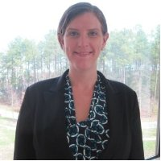

---
---
---
---

<link rel="stylesheet" href="styles.css" type="text/css">

 

I'm a Research Data Scientist specializing in decision making under uncertainty. I design and build econometric and machine learning solutions for complex problems.

I completed my graduate education at The College of William and Mary where I studied Marine Science, Toxicology, and Public Policy.  My diverse research interests prepared me for a career in Data Science with exposure to multiple modeling and experimentation techniques.

After graduate school, I worked for several years as a geospatial modeler for the US EPA. This is where I honed my programming skills in both R and Python. From EPA I moved onto RTI International where I designed and built websites, decision support tools, and models for a variety of clients including the FDA, EPA, and Nature Conservancy amongst others.

